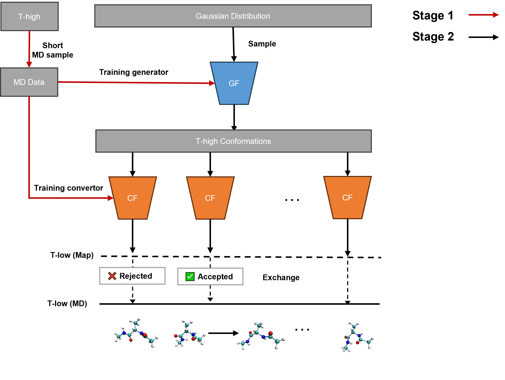

# GREX (Generative Replica-Exchange)


The systems studied are: Double-well, Ala2, and Chignolin

## Installation

### 1) Create Conda environment
An `environment.yml` file is provided in the project root. Run:
```bash
conda env create -f environment.yml
conda activate grex
```

### 2) Dependencies
The `environment.yml` already includes the following dependencies (including pip-installed packages):
- [einops](https://github.com/arogozhnikov/einops/)
- [pytorch](https://github.com/pytorch/pytorch)
- [numpy](https://github.com/numpy/numpy)
- [bgflow](https://github.com/noegroup/bgflow)
- [OpenMM](https://github.com/openmm/openmm)
- [bgmol](https://github.com/noegroup/bgmol)
- [nflows](https://github.com/bayesiains/nflows)
- [allegro](https://github.com/mir-group/allegro) (for Graph Neural Networks)
- [nequip](https://github.com/mir-group/nequip) (for Graph Neural Networks)
- [matplotlib](https://github.com/matplotlib/matplotlib)

### 3) For GPU users (optional)
If you need a CUDA-enabled PyTorch build, create the environment first, then install the matching version from the [official PyTorch guide](https://pytorch.org/get-started/locally/).


